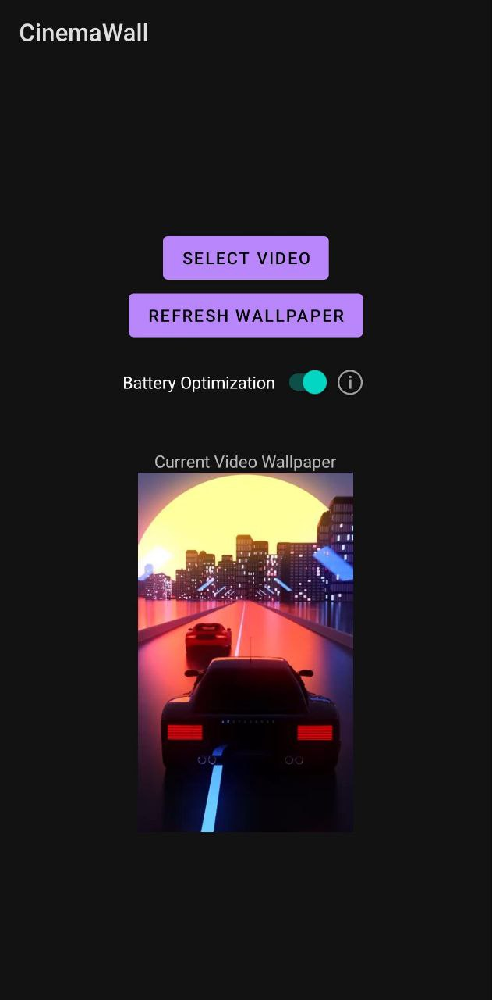

# CinemaWall 🎬

A modern Android app that transforms your device's wallpaper into a cinematic video experience. Set any video as your live wallpaper and enjoy dynamic backgrounds that bring your screen to life.

## ✨ Features

- **Video Wallpapers**: Set any video file as your device wallpaper
- **Battery Optimization**: Smart power management with customizable settings
- **Smooth Playback**: Optimized video rendering for seamless performance
- **Modern UI**: Clean, intuitive interface designed for the best user experience
- **Adaptive Icons**: Beautiful app icon that adapts to your device theme

## 🚀 Getting Started

### Installation

Simply go to our [Releases](https://github.com/God-Rayz/CinemaWall/releases) section and download the latest APK!

### Usage

1. Launch CinemaWall
2. Select a video file from your device
3. Customize battery optimization settings
4. Set as wallpaper and enjoy!

## 🛠️ Technical Details

- **Language**: Kotlin
- **Minimum SDK**: API 21 (Android 5.0)
- **Target SDK**: Latest Android version
- **Architecture**: MVVM with LiveData
- **Dependencies**: AndroidX, Material Design Components

## 📱 Screenshots

  
  
  ### 🎥 Demo Video
  

    
  

  
<em>Click the image above to watch the demo video!</em>

*See CinemaWall in action! Select any video and set it as your live wallpaper.*

## 📥 Downloads

Ready to try CinemaWall? Download the latest APK from our [Releases](https://github.com/God-Rayz/CinemaWall/releases) page!

**Latest Version**: [v1.0.1](https://github.com/God-Rayz/CinemaWall/releases/latest)

## 🎯 Why I Built This

I created CinemaWall completely **free** because I wanted a live wallpaper app without:
- ❌ In-app purchases
- ❌ Ads
- ❌ Trackers
- ❌ Unnecessary file permissions

This app is built with privacy and user experience in mind. No hidden costs, no data collection, just a clean, functional video wallpaper app that does exactly what it promises.

## 🤝 Contributing

Contributions are welcome! Please feel free to submit a Pull Request.

## 📄 License

This project is licensed under the MIT License - see the [LICENSE](LICENSE) file for details.

## 🙏 Acknowledgments

- Android team for the excellent platform
- Material Design team for the beautiful design system
- Open source community for inspiration and tools

---

Made with ❤️ by [God-Rayz](https://github.com/God-Rayz)
